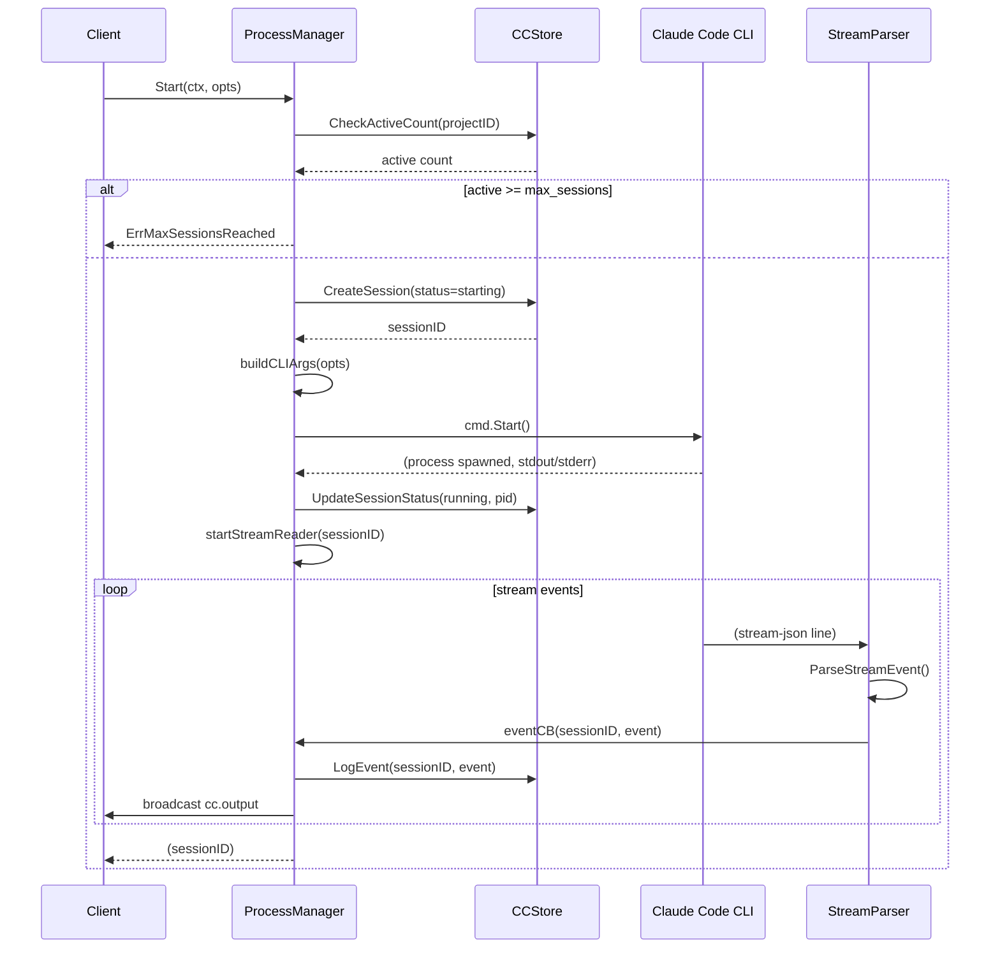

# 14 - Claude Code Orchestration

Managed-mode feature enabling GoClaw to orchestrate Claude Code CLI processes as a service. Exposes project management and interactive session APIs over HTTP and WebSocket.

---

## 1. Overview

Claude Code Orchestration allows users to:
- Create and configure Claude Code projects (working directories, allowed tools, environment)
- Start interactive Claude Code CLI sessions with real-time process output
- Send prompts to running sessions and receive streamed responses
- Monitor session metrics (tokens, cost, execution time)
- Access event logs for all session activities

The system spawns Claude Code CLI as child processes, parses their JSON stream output, persists results to PostgreSQL, and broadcasts events to connected WebSocket clients in real-time.

---

## 2. Architecture

### Component Diagram

```
Web UI (/cc/projects, /cc/sessions)
    ↓
HTTP API (/v1/cc/*) + WebSocket RPC (cc.*)
    ↓
ClaudeCodeHandler + ClaudeCodeMethods
    ↓
ProcessManager (spawn, monitor, lifecycle)
    ↓
Claude Code CLI (child process)
    ↓ (stream-json stdout)
StreamParser
    ↓
CCStore (PostgreSQL)
    ↓
Message Bus (broadcast cc.output, cc.session.status events)
    ↓
WebSocket Clients (real-time updates)
```

### Concurrency Model

- **Per-project session limit** enforced via `max_sessions` (default 3)
- **Single-threaded stream parsing** (no goroutines within parser)
- **Thread-safe process map** (ProcessManager.mu guards process registry)
- **Asynchronous event logging** via background task or immediate DB write
- **Context cancellation** propagates kill signal to child process on shutdown

---

## 3. ProcessManager Lifecycle

The `ProcessManager` in `internal/claudecode/manager.go` manages the full lifecycle of Claude Code processes.

### Start Flow



### State Transitions

```
STARTING
  ↓ (cmd.Start succeeds)
RUNNING
  ↓ (process completes or errors)
COMPLETED
  or
FAILED
  or
STOPPED (killed by user)
```

### Process Cleanup

When a session completes or fails:
1. **Read remaining stdout** (stream events)
2. **Parse final stream events** (cost, token counts)
3. **Update session status** (completed/failed)
4. **Set stopped_at timestamp**
5. **Close file descriptors** (stdout, stderr)
6. **Remove from process map** (ProcessManager.processes)

---

## 4. Stream Event Parsing

Claude Code CLI outputs NDJSON (newline-delimited JSON) with stream events. Each line is a JSON object with:

```json
{
  "type": "event_type",
  "subtype": "optional_subtype",
  "session_id": "claude_session_id_if_present",
  "result": {...},
  "raw": {...}
}
```

### Parser (internal/claudecode/parser.go)

```go
func ParseStream(reader io.Reader) (StreamEvent, error) {
    // 1. Read line from reader
    // 2. Unmarshal JSON
    // 3. Extract type, subtype, session_id
    // 4. For "result" events, extract input_tokens, output_tokens, cost_usd
    // 5. Return StreamEvent
}
```

### Event Types (Streamed)

Common stream event types:
- `chunk` — Text output from Claude
- `tool.call` — Tool invocation (name, parameters)
- `tool.result` — Tool result data
- `result` — Final result (input_tokens, output_tokens, cost_usd)
- `thinking` — Extended thinking preview (if enabled)

---

## 5. CCStore Interface

Manages persistence of projects, sessions, and logs. Implemented as `PGCCStore` in PostgreSQL (managed mode only; nil in standalone).

### Methods

**Projects (5):**
```go
CreateProject(ctx context.Context, proj *CCProjectData) error
GetProject(ctx context.Context, id uuid.UUID) (*CCProjectData, error)
ListProjects(ctx context.Context, ownerID string) ([]*CCProjectData, error)
UpdateProject(ctx context.Context, id uuid.UUID, patch map[string]any) error
DeleteProject(ctx context.Context, id uuid.UUID) error
```

**Sessions (5):**
```go
CreateSession(ctx context.Context, sess *CCSessionData) error
GetSession(ctx context.Context, id uuid.UUID) (*CCSessionData, error)
ListSessions(ctx context.Context, projectID uuid.UUID) ([]*CCSessionData, error)
UpdateSessionStatus(ctx context.Context, id uuid.UUID, status string) error
ActiveSessionCount(ctx context.Context, projectID uuid.UUID) (int, error)
```

**Logs (3):**
```go
LogEvent(ctx context.Context, sessionID uuid.UUID, event *CCSessionLogData) error
GetSessionLogs(ctx context.Context, sessionID uuid.UUID) ([]*CCSessionLogData, error)
DeleteProjectSessions(ctx context.Context, projectID uuid.UUID) error
```

### Data Types

**CCProjectData:**
```go
type CCProjectData struct {
    ID            uuid.UUID           // UUID v7
    Name          string              // Display name
    Slug          string              // UNIQUE identifier
    WorkDir       string              // Working directory for Claude Code
    Description   string              // Optional description
    AllowedTools  []string            // Tool names (JSONB array)
    EnvVars       map[string]string   // Encrypted (AES-256-GCM)
    ClaudeConfig  map[string]any      // Model, temperature, etc. (JSONB)
    MaxSessions   int                 // Concurrent limit
    OwnerID       string              // Project owner (user_id)
    TeamID        *uuid.UUID          // Team context (nullable)
    Status        string              // "active" or "archived"
    CreatedAt     time.Time
    UpdatedAt     time.Time
}
```

**CCSessionData:**
```go
type CCSessionData struct {
    ID                uuid.UUID
    ProjectID         uuid.UUID
    ClaudeSessionID   *string     // For --resume
    Label             string      // User prompt (first 200 chars)
    Status            string      // starting, running, completed, failed, stopped
    PID               *int        // OS process ID
    StartedBy         string      // user_id
    InputTokens       int64
    OutputTokens      int64
    CostUSD           float64
    Error             *string
    StartedAt         time.Time
    StoppedAt         *time.Time
    CreatedAt         time.Time
    UpdatedAt         time.Time
}
```

**CCSessionLogData:**
```go
type CCSessionLogData struct {
    ID         uuid.UUID
    SessionID  uuid.UUID
    EventType  string      // "chunk", "tool.call", "result", etc.
    Content    map[string]any  // Full parsed event (JSONB)
    Seq        int         // Event ordering
    CreatedAt  time.Time
}
```

---

## 6. HTTP API

Managed-mode HTTP endpoints for Claude Code projects and sessions. Handlers in `internal/http/claude_code.go`.

### Projects

| Method | Path | Purpose |
|--------|------|---------|
| GET | `/v1/cc/projects` | List owner's projects |
| POST | `/v1/cc/projects` | Create new project |
| GET | `/v1/cc/projects/{id}` | Get project details |
| PUT | `/v1/cc/projects/{id}` | Update project config |
| DELETE | `/v1/cc/projects/{id}` | Delete project (cascades to sessions) |

### Sessions

| Method | Path | Purpose |
|--------|------|---------|
| GET | `/v1/cc/projects/{id}/sessions` | List project sessions |
| POST | `/v1/cc/projects/{id}/sessions` | Start new session |
| GET | `/v1/cc/sessions/{id}` | Get session status and metrics |
| POST | `/v1/cc/sessions/{id}/prompt` | Send prompt to running session |
| POST | `/v1/cc/sessions/{id}/stop` | Stop running session |
| GET | `/v1/cc/sessions/{id}/logs` | Get session event logs |

### Request/Response Examples

**Create Project:**
```json
POST /v1/cc/projects
{
  "name": "Backend Refactor",
  "slug": "backend-refactor",
  "work_dir": "/path/to/repo",
  "allowed_tools": ["bash", "git"],
  "max_sessions": 3
}

Response (201):
{
  "id": "uuid",
  "name": "Backend Refactor",
  "slug": "backend-refactor",
  "owner_id": "user123",
  "status": "active"
}
```

**Start Session:**
```json
POST /v1/cc/projects/{id}/sessions
{
  "prompt": "Refactor the authentication module",
  "model": "claude-opus-4-6"
}

Response (201):
{
  "id": "session-uuid",
  "project_id": "project-uuid",
  "status": "starting",
  "started_by": "user123"
}
```

**Get Session Logs:**
```
GET /v1/cc/sessions/{id}/logs

Response (200):
{
  "logs": [
    {
      "event_type": "chunk",
      "content": {"text": "I'll start by examining the auth module..."},
      "seq": 0
    },
    {
      "event_type": "tool.call",
      "content": {"tool_name": "bash", "args": {"command": "ls -la src/auth/"}},
      "seq": 1
    },
    ...
  ]
}
```

---

## 7. WebSocket RPC Methods

Handlers in `internal/gateway/methods/claude_code.go`. Methods follow the naming convention `cc.*`.

### Projects Methods

| Method | Purpose |
|--------|---------|
| `cc.projects.list` | List owner's projects |
| `cc.projects.create` | Create new project |
| `cc.projects.get` | Get project details |
| `cc.projects.update` | Update project config |
| `cc.projects.delete` | Delete project |

### Sessions Methods

| Method | Purpose |
|--------|---------|
| `cc.sessions.list` | List project sessions |
| `cc.sessions.start` | Start new session |
| `cc.sessions.get` | Get session status and metrics |
| `cc.sessions.prompt` | Send prompt to running session |
| `cc.sessions.stop` | Stop running session |
| `cc.sessions.logs` | Get session event logs |

### RPC Protocol

**Request Example (start session):**
```json
{
  "method": "cc.sessions.start",
  "params": {
    "project_id": "proj-uuid",
    "prompt": "Fix the login bug",
    "model": "claude-opus-4-6",
    "max_turns": 10
  }
}
```

**Response:**
```json
{
  "result": {
    "id": "session-uuid",
    "project_id": "proj-uuid",
    "status": "starting"
  }
}
```

---

## 8. WebSocket Events

Broadcast events sent to all connected clients. Defined in `pkg/protocol/events.go`.

### cc.output

Fired for each parsed stream event from the Claude Code process.

```json
{
  "type": "cc.output",
  "data": {
    "session_id": "session-uuid",
    "event_type": "chunk",
    "content": {
      "text": "I'll now examine the authentication module..."
    },
    "seq": 42
  }
}
```

### cc.session.status

Fired when session status changes (starting → running, running → completed, etc.).

```json
{
  "type": "cc.session.status",
  "data": {
    "session_id": "session-uuid",
    "project_id": "proj-uuid",
    "status": "running",
    "pid": 12345,
    "input_tokens": 1200,
    "output_tokens": 450
  }
}
```

---

## 9. UI Architecture

React components in `ui/web/src/pages/claude-code/` provide project and session management interfaces.

### Pages and Components

| Component | Purpose | Route |
|-----------|---------|-------|
| `projects-page.tsx` | List projects, create new, status overview | `/cc/projects` |
| `project-detail-page.tsx` | Project settings, session history, metrics | `/cc/projects/:id` |
| `session-terminal-page.tsx` | Real-time terminal view, stream events | `/cc/sessions/:id` |
| `session-page.tsx` | Route wrapper | `/cc/sessions/:id` |

### Supporting Components

| Component | Purpose |
|-----------|---------|
| `project-card.tsx` | Project preview card (name, status, session count) |
| `project-create-dialog.tsx` | Form to create new project |
| `session-start-dialog.tsx` | Form to start new session |
| `agent-status-indicator.tsx` | Visual status badge (starting, running, completed, failed) |
| `hooks/` | React hooks for API communication, real-time updates |

### Real-Time Updates

Projects and sessions subscribe to WebSocket events:

```typescript
useEffect(() => {
  ws.on('cc.output', (event) => {
    // Append to terminal output
    setTerminal(prev => [...prev, event.data]);
  });

  ws.on('cc.session.status', (event) => {
    // Update session metrics and status
    setSession(event.data);
  });

  return () => {
    ws.off('cc.output');
    ws.off('cc.session.status');
  };
}, [ws]);
```

---

## 10. Session Management

### Concurrent Session Limits

Projects enforce a `max_sessions` limit (default 3). When starting a new session:
1. Query active sessions count (status IN 'starting', 'running')
2. If count >= max_sessions, return `ErrMaxSessionsReached`
3. Otherwise proceed with session creation

### Git Worktree Isolation

For projects with active sessions, new sessions may use git worktrees to isolate changes:

```go
if opts.UseWorktree || active > 0 {
    wtPath, err := CreateWorktree(projectID, sessionID)
    if err != nil {
        // Fallback to direct workdir
    } else {
        workDir = wtPath
    }
}
```

Worktree names: `claude-code-{sessionID}`. Cleanup on session completion.

### Environment Variables

Project `env_vars` are encrypted (AES-256-GCM) at rest and injected into Claude Code process via environment.

---

## 11. Error Handling

### Session Start Errors

- `ErrMaxSessionsReached` — Active session count at limit
- `ValidateWorkDir()` — Invalid or inaccessible working directory
- `cmd.Start()` — Process creation failed (permission denied, executable not found)

### Stream Parsing Errors

- Malformed JSON → log and skip line
- Missing required fields → skip event or use defaults
- Process crash → set status to "failed", capture stderr

### Recovery

- **Process crash:** Session marked failed, error recorded, clients notified via `cc.session.status` event
- **Connection loss:** Client reconnects and queries latest session state via `cc.sessions.get`
- **Partial stream:** Logs saved as-is; last event may be incomplete

---

## 12. Security

### Access Control

- **Owner check:** Only project owner can CRUD projects
- **Team access:** Team members can access team-associated projects
- **Session owner:** Only `started_by` user can send prompts or stop session (or admin)

### Credential Protection

- `env_vars` encrypted with AES-256-GCM (key from `GOCLAW_ENCRYPTION_KEY`)
- Plaintext only in memory after decryption
- API responses mask sensitive config (not implemented yet; recommend masking model keys)

### Rate Limiting

- Global gateway rate limiter applies to `/v1/cc/*` endpoints
- Per-project session limit prevents resource exhaustion

### Input Validation

- Work directory must exist and be readable
- Project slug must be alphanumeric + hyphens (validated server-side)
- Prompt limited to reasonable length (e.g., 10,000 chars)
- Environment variable names validated (alphanumeric + underscores)

---

## 13. Monitoring and Observability

### Session Metrics

Tracked in `cc_sessions` table:
- `input_tokens` — Cumulative input tokens
- `output_tokens` — Cumulative output tokens
- `cost_usd` — Estimated API cost
- `started_at`, `stopped_at` — Execution time
- `error` — Error message on failure

### Event Logs

All stream events persisted in `cc_session_logs` with:
- `event_type` — Stream event type
- `content` — Full parsed event (JSONB)
- `seq` — Event ordering

### Real-Time Dashboards

UI displays:
- **Project list** with active session counts, status
- **Session detail** with live terminal output, metrics, error log
- **Session history** with metrics (duration, cost, tokens)

---

## 14. File Reference

**Backend:**

| File | Purpose |
|------|---------|
| `internal/claudecode/manager.go` | ProcessManager: spawn, monitor, lifecycle |
| `internal/claudecode/types.go` | StreamEvent, StartOpts, EventCallback |
| `internal/claudecode/parser.go` | Stream event parsing (NDJSON) |
| `internal/claudecode/validate.go` | Work directory validation |
| `internal/claudecode/worktree.go` | Git worktree creation + cleanup |
| `internal/http/claude_code.go` | HTTP handlers (11 endpoints) |
| `internal/gateway/methods/claude_code.go` | WebSocket RPC methods (11 handlers) |
| `internal/store/cc_store.go` | CCStore interface definition |
| `internal/store/pg/claude_code.go` | PGCCStore: PostgreSQL implementation |
| `migrations/000010_claude_code.up.sql` | Database schema (3 tables + indices) |

**Frontend:**

| File | Purpose |
|------|---------|
| `ui/web/src/pages/claude-code/projects-page.tsx` | Project list and creation |
| `ui/web/src/pages/claude-code/project-detail-page.tsx` | Project settings and session history |
| `ui/web/src/pages/claude-code/session-terminal-page.tsx` | Real-time terminal view |
| `ui/web/src/pages/claude-code/session-page.tsx` | Route wrapper |
| `ui/web/src/pages/claude-code/project-card.tsx` | Card component |
| `ui/web/src/pages/claude-code/project-create-dialog.tsx` | Create project dialog |
| `ui/web/src/pages/claude-code/session-start-dialog.tsx` | Start session dialog |
| `ui/web/src/pages/claude-code/agent-status-indicator.tsx` | Status badge |
| `ui/web/src/pages/claude-code/hooks/` | React hooks for API |

---

## 15. Integration Points

### Startup Wiring

In `cmd/gateway.go`:
1. Create `PGCCStore` (managed mode only)
2. Initialize `ProcessManager(ccStore, eventCallback)`
3. Wire event callback to broadcast `cc.output` + `cc.session.status` events
4. Register `ClaudeCodeHandler` (HTTP routes)
5. Register `ClaudeCodeMethods` (WebSocket methods)

### Event Broadcasting

```go
processManager := claudecode.NewProcessManager(
    ccStore,
    func(sessionID uuid.UUID, event claudecode.StreamEvent) {
        // Log event
        ccStore.LogEvent(ctx, sessionID, &store.CCSessionLogData{...})

        // Broadcast to clients
        msgBus.Publish(&protocol.Event{
            Type: protocol.EventCCOutput,
            Data: map[string]any{
                "session_id": sessionID,
                "event": event,
            },
        })
    },
)
```

### Shutdown

ProcessManager cleanup on graceful shutdown:
1. Iterate all active processes
2. Send SIGTERM to each process
3. Wait for graceful exit (with timeout)
4. Force SIGKILL if needed
5. Release git worktrees

---

## 16. Future Enhancements

Potential improvements:
- **Multi-language support:** Extend to other CLI tools (bash, python, etc.)
- **Artifact extraction:** Extract and display file changes, diffs, code blocks
- **Cost prediction:** Estimate cost before running based on prompt + model
- **Session resume:** Resume interrupted sessions via Claude's session ID
- **Audit logging:** Track all project and session changes for compliance
- **Webhook delivery:** Push events to external systems (Slack, Discord, etc.)
